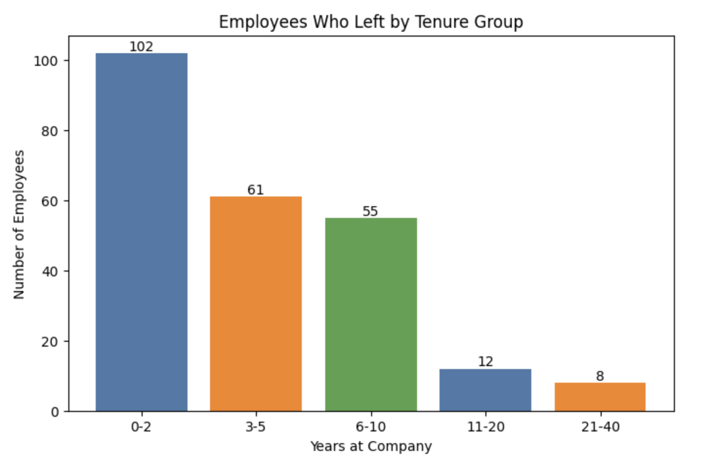

# HR Attrition Analysis with Python

## Project Overview

This project explores employee attrition patterns using Python and the IBM HR Analytics Employee Attrition dataset.

The analysis focuses on understanding factors associated with employee turnover, identifying patterns among employees who left the company, and generating insights that could support employee retention strategies.

This project represents the exploratory analysis stage of the HR analytics process. The findings were later used to create an interactive Power BI dashboard for business users.

---

## Business Problem

Employee attrition can increase recruitment costs, impact productivity, and create challenges for workforce planning.

The HR department wants to understand which employee characteristics are associated with higher turnover in order to identify potential retention risks and support data-driven decision-making.

---

## Objectives

- Explore and clean the HR dataset.
- Calculate the overall employee attrition rate.
- Analyse attrition patterns across selected employee characteristics.
- Identify factors associated with employee turnover.
- Generate insights to support employee retention strategies.

---

## Dataset

**Dataset:** IBM HR Analytics Employee Attrition & Performance

The dataset contains information on 1,470 rows** and **38 columns, including:

- Employee demographics
- Department and job role
- Compensation information
- Employee satisfaction scores
- Performance indicators
- Years at company

**Source:** Kaggle – IBM HR Analytics Employee Attrition Dataset.

---

## Tools & Technologies

- Python (Pandas, Matplotlib)
- Data cleaning and preprocessing
- Exploratory Data Analysis (EDA)
- GroupBy analysis
- Data visualisation

---

## Analysis Highlights

### Data Exploration & Cleaning

The first stage of the analysis involved exploring the dataset structure, checking data types, identifying missing values, and removing duplicate records.

```
df.info()
df.describe()
df.isnull().sum()
df_clean = df.copy()
df_clean = df.drop_duplicates()
df_clean[df_clean["YearsWithCurrManager"].isnull()]
```
### Attrition Analysis Using GroupBy
Calculating attrition rate and attrition patterns across different employee characteristics.
```
department_total=df_clean.groupby('Department').size()
department_attrition = df_clean[df_clean["Attrition"] == "Yes"].groupby("Department").size()
department_attrition_rate = (department_attrition / department_total * 100).round(1).sort_values(ascending=False)
```
### Data Visualisation
Matplotlib was used to create charts to identify trends and compare attrition patterns.
```
plt.figure(figsize=(8,5))
bars = plt.bar(
    tenure_attrition.index,
    tenure_attrition.values,
    color=["#4C78A8", "#F58518", "#54A24B"]
)
plt.xlabel("Years at Company")
plt.ylabel("Number of Employees")
plt.title("Employees Who Left by Tenure Group")
plt.bar_label(bars)
plt.show()
```


---

## Key Findings

- **Overall attrition rate:** 16.1% of employees left the company.

- **Department:** Sales recorded the highest attrition rate (20.67%), followed by Human Resources (19.05%) and Research & Development (13.75%).

- **Overtime:** Employees who left the company were more likely to have worked overtime, suggesting a possible relationship between overtime and employee turnover.

- **Tenure:** Attrition was highest among employees with 0–2 years of service, indicating increased retention risks during the early stages of employment.

- **Job Satisfaction:** Employees who left were distributed across all satisfaction levels, with no clear relationship identified in this dataset.

  
➡️ [Open HR Analytics Project Notebook](HR_Analytics_Project.ipynb)


---

## 🔗 Related Project

Following this exploratory analysis, an interactive **Power BI HR Attrition Dashboard** was created to present key findings through business-focused visualisations and KPIs.

➡️ [HR Attrition Analysis Dashboard](https://github.com/YuliaGrinenko/HR-Attrition-Dashboard-Power-BI)
